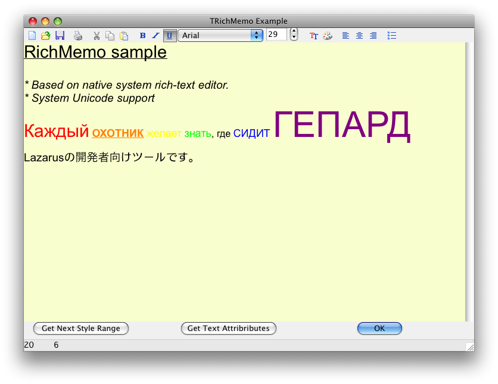
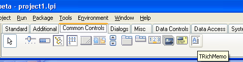
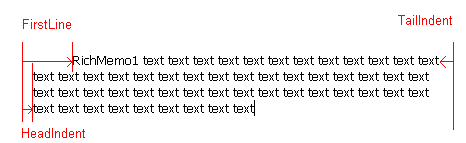
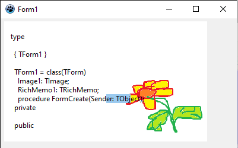
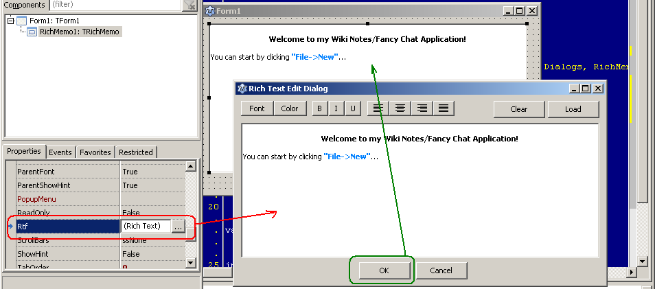
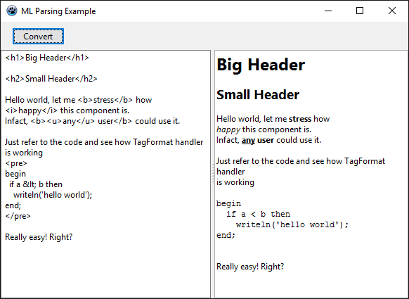
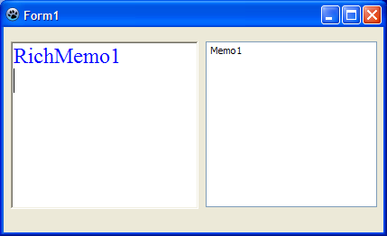
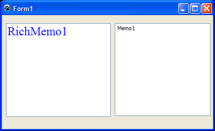
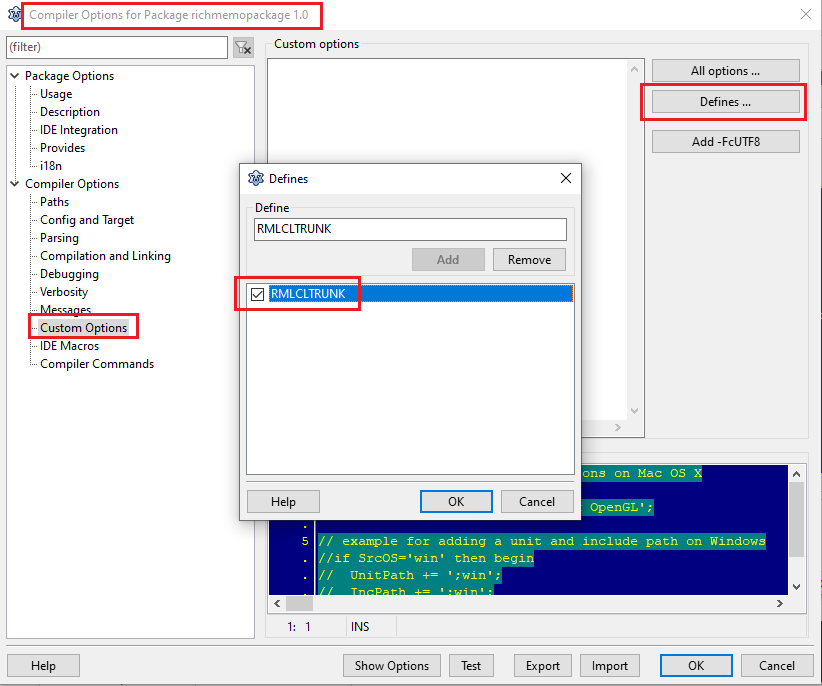

# RichMemo

RichMemo is a package that includes a component to replace the Delphi TRichEdit component. It's designed in cross-platform way, so implementation is possible for the following platforms: Win32, MacOSX and Linux. Since, being cross-platform is the primary target, the native RichMemo API can be extended to make it Delphi's RichEdit compatible.

  
RichMemo macOS screenshot (thanks to Dominique Louis)

Its main characteristics are

- Text highlight
- System based Unicode edit support

Planned: (patches are welcomed)

- Adding images into text
- Embedding LCL Controls?

The download contains the component, an installation package and a demo application, that illustrates the features of the component along with some instrumentation for evaluating the chart on a given system.

Please add your bugreports, feature requests, pull request on [GitHub](https://github.com/skalogryz/richmemo/issues).

## Licensing

Author: Dmitry 'skalogryz' Boyarintsev

License: [modified LGPL](COPYING.modifiedLGPL.txt) (the same as the FPC RTL and the Lazarus LCL). You can contact the author if the modified LGPL doesn't work with your project licensing.

## Download

The easiest way to install the stable version of the component is via the [Online Package Manager](https://wiki.freepascal.org/Online_Package_Manager) included in current Lazarus versions.

The latest trunk is available on GitHub: [https://github.com/skalogryz/richmemo/](https://github.com/skalogryz/richmemo/). The latest sources can be downloaded by [this GitHub link](https://github.com/skalogryz/richmemo/archive/refs/heads/master.zip).

## Installation

- Download the package set.
- Open *richmemo_design.lpk* package, and install it, rebuilding the IDE.
- TRichMemo is added to the 'Common Controls' component page.



Originally *richmemopackage* was a single file, containing IDE specific and run-time needed classes. However, that meant that IDEIntf package would be a requirement for any project using RichMemo. In order to mitigate that the package was split into to separate packages:

- richmemopackage - run-time rich memo component.
- richmemo_design - IDE extensions to support for RichMemo component.

### Troubleshooting

- If installation fails in /openSUSE Leap 16.0/, installing /Mesa-libGL-devel/ and /Mesa-libGLU-devel/ might solve the issue.

## Font Parameters

Font parameters are generally represented by TFontParams record. The type is used to describe *rich* attributes of the font. Some attributes goes beyond the scope of TFont class, thus an extra type was necessary. However, most of the TFont related data types are reused (i.e. TFontStyles).

- Name - name of the font (family).
- Size - size of the font in points (passing a negative value might produce unexpected results).
- Color - color of the font.
- Style - font styles, including Bold, italic, strike-through, underline.
- HasBkClr - boolean flag, if the text for the should have background color (if true, BkColor field is used, otherwise BkColor is ignored). Transparency is not supported.
- BkColor - background (aka highlight) color for the text.
- VScriptPos - vertical adjustment for the text
  - vpNormal - no special position.
  - vpSubscript - the text is subscript.
  - vpSuperscript - the text is superscript.

  The actual vertical offset of super/sub scripts depends on OS implementation and currently cannot be controlled.

You can assign FontParams from TFont structure. For that you'll need to use GetFontParams(afont: TFont) function. Note, most of LCL controls have TFont set to "default" values. These are not actual values, but rather an indication that control's default font should be used (similar to crDefault for TColor).

GetFontParams function resolves "Default" font name and returns the actual font family name.

## Methods

### SetTextAttributes

```delphi
procedure SetTextAttributes(TextStart, TextLen: Integer; AFont: TFont);
```

- TextStart : Integer - the first character to be modified
- TextLen : Integer - number of characters to be modified
- AFont : TFont - a font that should be applied to the part of the text

```delphi
procedure SetTextAttributes(TextStart, TextLen: Integer; const TextParams: TFontParams);
```

- TextStart : Integer - the first character to be modified
- TextLen : Integer - number of characters to be modified
- TextParams : TFontParams - font parameters to be set

SetTextureAttributes methods are changing specified text range style. Font parameters is passed in both methods, by AFont parameter (LCL TFont object) or by TFontParams (declared at RichMemo).

Setting text attributes does not change current selection. If it's necessary to modify the style of currently selected text, you should use SelStart and SelLength as a text range values:

```delphi
RichMemo1.SetTextAttributes(RichMemo1.SelStart, RichMemo1.SelLength, FontDialog1.Font);
```

### GetTextAttributes

```delphi
function GetTextAttributes(TextStart: Integer; var TextParams: TFontParams): Boolean; virtual;
```

- TextStart : Integer - the character position to be queried for font parameters
- var TextParams : TFontParams - output value, filled with character's font attributes. If the method fails and returns false, record's field values is undefined.

Fill font params of the character, at TextStart position. Method returns True if textstart is valid character position, and False overwise.

### GetStyleRange

```delphi
function GetStyleRange(CharPos: Integer; var RangeStart, RangeLen: Integer): Boolean; virtual;
```

Returns a range of characters that share the same font parameters, i.e. all characters in the range has the same font name, size, color and styles.

- CharPos : Integer - a character that belongs to the style range. It's not necessary for this position to be at the begining on the style range. It can be in the middle on in the end of the style range. The first character position is returned by RangeStart parameter.
- var RangeStart : Integer - the first character in the range
- var RangeLen : Integer - number of characthers in the range

The method returns true if successed. the method returns false, if CharPos is incorrect value - more than available characters or some other error.

### CharAtPos

```delphi
function CharAtPos(x,y: Integer): Integer; virtual;
```

Returns zero-based character offset (not UTF8 position). Returns -1 if fails.

- x, y - is a point in the client area of the RichMemo control.

The method is aware of scrolling state of the control. Thus two calls to CharAtPos(0,0) might return different values if scroll positions is changed between calls. See "examples/hittest" for the sample of usage.

If specified x,y would be out of the content of RichMemo the return value is undefined. It is left up to widgetset to either return -1 or closes character available.

### SetRangeColor

```delphi
procedure SetRangeColor(TextStart, TextLength: Integer; FontColor: TColor);
```

The method sets color of characters in the specified range to the FontColor. Other font parameters (name, size, styles) are left unchanged.

- TextStart: Integer - the first character in the range
- TextLength: Integer - number of characters in the range
- FontColor: TColor - color that should be set

### SetRangeParams

```delphi
procedure SetRangeParams(TextStart, TextLength: Integer; ModifyMask: TTextModifyMask;
  const fnt: TFontParams; AddFontStyle, RemoveFontStyle: TFontStyles); overload;
```

The method changes font parameters in the specified range.

- TextStart - the first character in the range
- TextLength - number of characters in the range
- ModifyMask - shows what exact font attributes must be updated. The mask accepts any combination of the following values:
  - tmm_Color - font color would be modified (fnt.Color field must be populated)
  - tmm_Name - font name would be modified (fnt.Name field must be populated)
  - tmm_Size - font size would be modified (fnt.Size field must be populated)
  - tmm_Styles - font styles would be modified as specified by AddFontStyle, RemoveFontStyle parameters
  - tmm_BackColor - text highlight (background) color would be modified. (fnt.HasBkClr and fnt.BkColor fields must be populated)
  - Sending an empty mask will cause the method to return without making any changes.
- fnt - font parameters that are going to be used, depending on the ModifyMask values.
- AddFontStyle - set of styles that should be applied to the range (used only if tmm_Styles in ModifyMask, otherwise ignored)
- RemoveFontStyle - set of font style should should be removed from the range (used only if tmm_Styles in ModifyMask, otherwise ignored)

```delphi
procedure SetRangeParams(TextStart, TextLength: Integer;
    ModifyMask: TTextModifyMask; const FontName: String; 
    FontSize: Integer; FontColor: TColor; 
    AddFontStyle, RemoveFontStyle: TFontStyles);
```

The overloaded version of the method. It's just a wrapper around the parameter using TFontParams structure. The method doesn't support changing of background color, you should use the TFontParams version

- FontName - font name that should set (used only if tmm_Name in ModifyMask, otherwise ignored)
- FontColor - font color that should set (used only if tmm_Color in ModifyMask, otherwise ignored)

For example, if the following code is used

```delphi
RichMemo1.SetRangeParams ( 
   RichMemo1.SelStart, RichMemo1.SelLength,
   [tmm_Styles, tmm_Color], // changing Color and Styles only
   '',  // this is font name - it's not used, thus we can leave it empty
   0,  // this is font size - it's font size, we can leave it empty
   clGreen, // making all the text in the selected region green color
   [fsBold, fsItalic],  // adding Bold and Italic Styles
   []
);
```

### GetParaAlignment

Gets paragraph alignment

```delphi
function GetParaAlignment(TextStart: Integer; var AAlign: TParaAlignment): Boolean;
```

- TextStart - the position of the character that's belongs to the paragraph
- AAlign - gets alignment of a paragraph.

*Note*:

- Win32 - full-width Justification doesn't work on Windows XP and earlier.
- OSX - due to Carbon limitation, this is not working in Carbon, but works for Cocoa widgetset.

### SetParaAlignment

Sets paragraph alignent

```delphi
procedure SetParaAlignment(TextStart, TextLen: Integer; AAlign: TParaAlignment);
```

*Note*:

- Win32 - full-width Justification doesn't work on Windows XP and earlier.
- OSX - due to Carbon limitation, this is not working in Carbon, but works for Cocoa widgetset. It's also need to loaded that the correct alignment would be loaded from RTF file

### GetParaMetric

Returns paragraph metrics for a given paragraph



- FirstLine - an offset for the first line (in points), of the paragraph from the beginning of control
- TailIndent - an offset for each line (in points), except for the first line, of the paragraph from the end of the control
- HeadIndent - an offset for each line (in points) of the paragraph from the end of the control
- SpaceBefore - additional space before paragraph (in points)
- SpaceAfter - additional space after paragraph (in points)
- LineSpacing - a factor used to calculate line spacing between lines in the paragraph. The factor is applied to Font size (tallest in the line), not the line height. Thus it's matching CSS's line-height property. Note that normal line-spacing is 1.2. I.e. font of 12 pt size, an actual lines spacing set to 1.2, would result in 14pt line height.
  - not supported in WinXP or earlier
  - most of the system would not allow if linespacing is set to less than 1.2. The value would be ignored and they'd default to 1.2

*Note*

- RichEdit paragraph settings are specified in pixels, not points, so you'll need to either convert these sizes yourself or use RichMemoHelper methods
- the notation of "Left"/"Right" offsets is avoided to prevent confusion for RTL.

```delphi
function GetParaMetric(TextStart: Integer; var AMetric: TParaMetric): Boolean;
```

### SetParaMetric

Sets paragraph metrics

```delphi
procedure SetParaMetric(TextStart, TextLen: Integer; const AMetric: TParaMetric);
```

It's recommended to use InitParaMetric function in order to initialize TParaMetric structure. Otherwise zeroing structure out is by it size (i.e. FillChar(m, sizeof(TParaMetric), 0) is sufficient. If TParaMetric values are received from GetParaMetric call, then the structure is considered to be initialized properly.

### GetParaRange

Returns character range for a paragraph. The paragraph is identified by a character.

```delphi
function GetParaRange(CharOfs: Integer; var ParaRange: TParaRange): Boolean; 
function GetParaRange(CharOfs: Integer; var TextStart, TextLength: Integer): Boolean;
```

CharOfs - is a character that belongs to a paragraph which range is returned. TParaRange - is a structure that returns 3 fields

- start - the first character in the paragraph
- lengthNoBr - the length of the paragraph, excluding the line break character
- length - the length of the paragrpah, including the line break, if present the last line in the control doesn't contain a line break character, thus length = lengthNoBr value.

### SetParaTabs

Sets the set of tab stops to paragraphs in the specified length.

```delphi
procedure SetParaTabs(TextStart, TextLen: Integer; const AStopList: TTabStopList);
```

- TextStart
- TextLen
- AStopList - the structure that contains an array of tab stops.
  - Count - specifies the number of initialized elements.
  - Tabs - array contains the description of each tab stop, consisting of an Offset and Alignment.
    - Offset - the tab point offset in points (from the left side of the control)
    - Align - the alignment of the tab stop (tabLeft - default one, tabCenter, tabRight, tabDecimal).

*Notes*

Renamefest
    Prior to r4140 TTabAlignment enum values were taLeft, taCenter, taRight, taDecimal, but it did collide with Classes.TAlignment declarations. Thus the suffix was changed.
win32
    allows no more that 32 tabs
gtk2
    only tabLeft align is supported
carbon
    not implemented

### GetParaTabs

Gets the tab stops array. If no specific tabs were specified (widget default tab stops) AStopList count would be set to 0.

```delphi
function GetParaTabs(CharOfs: Integer; var AStopList: TTabStopList): Boolean;
```

### SetParaNumbering

Sets paragraphs automatic numbering and styles, such as bullets

```delphi
procedure SetParaNumbering(TextStart, TextLen: Integer; const ANumber: TParaNumbering); virtual;
```

- *TextStart* - the character of the the first paragraph to apply the style too
- *TextLength* - the number of characters that paragraph properties should be modified
- *TParaNumbering* - the structure describing the paragraph numbering information

  - *style* - the style of numbering

    Note: for cross-platform compatibility, it's recommended to use either *pnNone*, *pnBullet*, *pnNumber* or *pnCustomChar*. RTF provides more support for numbering, yet not every platform rich-text widgetset supports them

  - *Indent* - offset in points
  - *CustomChar* - custom character to be used as a "bullet" for each paragraph. Note, it's a WIDECHAR not UTF8
  - *NumberStart* - the initial number in numbering of paragraphs. Use for *pnNumber* only. Used to support "split" numbered lists
  - *SepChar*
  - *ForceNewNum* - if true and Style is pnNumber, NumberStart is used for the new numbering

for initializing the structure you can use InitParaNumbering() or InitParaNumber() functions. Also using Default() would work too

### SetRangeParaParams

Sets paragraph metrics selectively

```delphi
procedure SetRangeParaParams(TextStart, TextLength: Integer; ModifyMask: TParaModifyMask; const ParaMetric: TParaMetric);
```

- TextStart - the character of the the first paragraph to apply the style too
- TextLength - the number of characters that paragraph properties should be modified
- ModifyMask - masks the identifies what para metric should be set for each paragraph within TextStart..TextLength block. Other characters will be left unmodified. Members of the set are
  - pmm_FirstLine - changes the first line indentation. FirstLine field of ParaMetric must be initialized
  - pmm_HeadIndent - changes the heading paragraph indentation. HeadIndent field of ParaMetric must be initialized
  - pmm_TailIndent - changes the trail paragraph indentation. TailIndent field of ParaMetric must be initialized
  - pmm_SpaceBefore - changes the space preceding . SpaceBefore field of ParaMetric must be initialized
  - pmm_SpaceAfter - changes the space after (below) the paragraph. SpaceAfter field of ParaMetric must be initialized
  - pmm_LineSpacing - line spacing within paragraph. LineSpace field of ParaMetric must be initialized
- ParaMetric - the structure containing the values to be set. Only fields specified by ModifyMask should be initialized

### LoadRichText

```delphi
function LoadRichText(Source: TStream): Boolean; virtual;
```

- Source: TStream - a stream to read richtext data from

The method loads RTF encoded data from the specified stream. Returns true if success, and false otherwise. If source is nil, the method returns false

The content of TRichMemo is completely replaced by the content on the source stream. Current text selection is reset.

### SaveRichText

```delphi
function SaveRichText(Dest: TStream): Boolean; virtual;
```

- Source: TStream - a stream to read richtext data from

The method saves RTF encoded data to the specified stream. Returns true if success, and false otherwise. If source is nil, the method returns false

Current state of TRichMemo is unchanged after the method returns

### Search

```delphi
function Search(const ANiddle: string; Start, Len: Integer; const SearchOpt: TSearchOptions): Integer;
```

- ANiddle: string - a text to search for
- Start: Integer - a character position to start search from, if -1 or 0 search from the start
- Len: Integer - length (in characters, not bytes) of the text to search for the niddle.
- SearchOpt: TSearchOptions
  - soMatchCase - case sensitive search
  - soBackward - searching from the end of the document to the character identified by "Start" parameter
  - soWholeWord - searching for the whole word

The method returns the character position of the found sub-string. The position is suitable for use in SelStart property. However, might not be usable for the direct Copy operation, if Unicode characters are present in the code. Instead UTF8Copy should be used.

If the ANiddle was not found in the text, -1 is returned

```delphi
function Search(const ANiddle: string; Start, Len: Integer; const SearchOpt: TSearchOptions;
  var TextStart, TextLength: Integer): Boolean;
```

(The method is introduced with r5115)

- ANiddle: string - a text to search for
- Start: Integer - a character position to start search from, if -1 or 0 search from the start
- Len: Integer - length (in characters, not bytes) of the text to search for the niddle.
- SearchOpt: TSearchOptions
  - soMatchCase - case sensitive search
  - soBackward - searching from the end of the document to the character identified by "Start" parameter
  - soWholeWord - searching for the whole word
- (output) ATextStart - a position of the text found (in characters)
- (output) ATextLength - length of the text found (in characters (cursor positions!))

The method returns the true if searched sub-string is found, false otherwise.

The returned ATextStart and ATextLength values are suitable for use in SelStart and SelLength properties.

*Note*: for complex scripts, the found text might be exactly the same as the sub-string searched. The search behavior (on complex scripts) is widgetset specific. Thus searching for the same string on different widgetsets (i.e. win32 or gtk2) might produce different results. If you need the same results and don't get them, please create a bug report.

If you need to extract the found text, you should use GetText() method (passing ATextStart and ATextLength values).

### GetText, GetUText

```delphi
function GetText(TextStart, TextLength: Integer): String;
function GetUText(TextStart, TextLength: Integer): UnicodeString;
```

- TextStart: Integer - a character position to start extract from. (0 - is the first character in the text).
- TextLength: Integer - length (in characters, not bytes) of the text to extract

GetText() returns UTF8 sub-string

GetUText() returns UTF16 sub-string

Current selection would not be affected by the operation. (If you see the selection affected, please report as an issue).

You should not consider the efficiency of either method. For example, WinAPI internally operates with UTF16 characters, thus GetUText() *might* be more efficient for it. While Gtk2 operates UTF8 and calling GetText() *might* be more efficient for it. Instead of thinking about underlying system, you should be considering the needs of your task.

### Redo

```delphi
procedure Redo;
```

The method redos the last change undone previously.

You can always call CanRedo to check, if there're any actions can be redone.

## Properties

### ZoomFactor

property ZoomFactor: double

Read/Write property. Controls zooming of the RichMemo content. 1.0 - is no-zoom. Less than < 1.0 - decrease zoom, more than 1.0 - increasing zooming. If 0 is set - value defaults to 1.0 zoom factor (no zoom).

### HideSelection

property HideSelection: Boolean default false

Read/Write property. If True RichMemo selection is hidden if the control is not focused. If False, the selection is shown all the time.

### CanRedo

property CanRedo: Boolean

If True, there're actions in Undo queue that can be redone. If False, there are no actions in Undo queue that can be redone. Calling to Redo won't have any effect.

### Transparent



property Transparent: Boolean

If True, the background of richmemo is not filled with any color, leaving any underlying controls or windows to be visible. (Suggested to be used with TImage that would provide the background) If False, (default) the background is filled with a solid color

Note that the property might not affect "border" style of the the richmemo. You need to set BorderStyle to bsNone in order to disable it. For macOS this also hides the focus ring (when the control is focused)

- Supported by Win32, Qt5 and Cocoa

### Rtf

property Rtf: String



Read/Write property that allows to read or write Rich-Text Formatted (RTF) text to the whole control. The intent of the property is to have an ability to set Rich-Text in design time, however the property would work in run-time as well.

If then property value is an empty string then Lines property is used as a plain text to initialize control value in load-time.

*Note:* The property is available in TRichMemo class only, it's not available (or even implemented in anyway) in TCustomRichMemo class. It is recommended to use LoadRichText/SaveRichText in order to modify the content of the page, just because they could consume less memory, than copying the whole rich-text into the memory.

*Cross-platform and Forward Compatibility Note:* - currently the property is implemented based on the widgetset providede Rich-text read/write routines. It is very likely that in near future it would be changed to used RichMemo read/write RTF stream code only. The issue is with older systems might not support the latest version of RTF.

So right now, you might run into an issue, If you create a project in Gtk2 and save the richmemo is design time containing Unicode characters. Then if you try to load it on the XP machine and would use widgetset native loader, you might see characters missing or rendered improperly. Changing to the usage of RichMemo RTF loader/saver will prevent this issue from happening. Currently you can also avoid it by registering RichMemo loaders (call RegisterRTFLoader, RegisterRTFSaver procedures in project initialization, before any RichMemo is loaded)

### CaretPos

Read/Write property. Gets or sets the positon of the caret in the memo.

property CaretPos: TPoint;

For example, to get the line of the caret use

```delphi
RichMemo1.CaretPos.Y;
```

For example, to move the caret to line 5, character 10 use

```delphi
RichMemo1.CaretPos := Point(10,5);
RichMemo1.SetFocus;
```

## Events

### OnSelectionChange

property OnSelectionChange: TNotifyEvent
TNotifyEvent = procedure (Sender: TObject) of object;

The event is fired whenever, selection is changed within RichMemo, either programmatically or due to the user action.

## TRichEditForMemo

The class helper that implements RichEdit programmatic interface. The helper is declared at RichEditHelpers unit, so you have to add it to the uses section. Helpers are available in FPC 2.6.0 or later.

### Methods

#### FindText

Searches a given range in the text for a target string

### Properties

#### SelAttributes

Reads/Modifies character attributes of the current selection.

### Paragraph

Reads/Modifies paragraph attributes of the current selection.

### RichMemoUtils

The unit is introduced to add some useful OS-specific features for handling working with RichMemo

#### InsertImageFromFile

```delphi
function InsertImageFromFile (const ARichMemo: TCustomRichMemo; APos: Integer;
     const FileNameUTF8: string;
     const AImgSize: TSize
 ): Boolean = nil;
```

/Disclaimer: the function would insert an image file into RichMemo (if implemented by the widgetset) But in a very inefficient way. The image would be read again and the memory would be re-allocated for the image every time. So please, don't use it for smileys in your chat instant messaging. A better API (with data caching) is considered. (That's why this method is not part of TCustomRichMemo class). /

- APos - position in the text
- AImgSize - size to be inserted in POINTS, not pixels!. If both cx and cy are 0, the image would not be resized at all. If only one cx, cy is zero results are undefined.

There's also an utility function *InsertImageFromFileNoResize* that calls InsertImageFromFile, passing size as 0.

An example of use

```delphi
procedure TForm1.Button1Click(Sender: TObject);
begin
 // running a dialog to select a picture to insert
 if OpenDialog1.Execute then 
   // inserting the picture at the current RichMemo cursor position
   InsertImageFromFileNoResize(RichMemo1, RichMemo1.SelStart, OpenDialog1.FileName);
end;
```

### InsertStyledText, InsertColorStyledText, InsertFontText

The set of functions that simplify appending and replacing of styled text. The specified style of the text is applied on the insertion. The common rule for all functions, if InsPos (insertion position) is negative - the text is appended to the end. In order to insert the text in the beginning of the test InsPos should set to 0.

The inserted text is not forced to be on a new line or add a new line. You might want to add LineFeed character to TestUTF8 parameter, if you want the inserted text to cause a new line to be started.

```delphi
procedure InsertStyledText(
  const ARichMemo: TCustomRichMemo; 
  const TextUTF8: String; 
  AStyle: TFontStyles;
  InsPos : Integer = -1 )
```

InsertStyledText inserts the styled text at the specified position.

```delphi
procedure InsertColorStyledText(
  const ARichMemo: TCustomRichMemo; 
  const TextUTF8: String; 
  AColor: TColor; 
  AStyle: TFontStyles;
  InsPos : Integer = -1 )
```

InsertColorStyledText inserts the text with specified style and color at the specified position. to the end of the RichMemo

```delphi
procedure InsertFontText(
  const ARichMemo: TCustomRichMemo; 
  const TextUTF8: String; 
  const prms: TFontParams;     
  InsPos : Integer = -1 )
```

InsertFontText inserts the text and applies specified FontParams to it.

You might want to create a class helper to implement these functions as methods for RichMemo. Beware, if you're using Delphi-compatibility helper - you might right into a conflict.

## Frequently Asked Questions

### Using RichMemo in Shared Libraries

Issue [#17412](http://bugs.freepascal.org/view.php?id=17412) If you need to use the component in a shared library, you might need to add -fPIC key to the compiler option of "the package" and the "project".

## (Delphi) RichEdit like interface

Issue [#14632](http://bugs.freepascal.org/view.php?id=14632) A typical problem is porting an existing code that's using RichEdit from Delphi. RichMemo interface doesn't match RichEdit in many ways. But there're two ways to handle that:

- you can either create a sub-class from TCustomRichMemo (or RichMemo) and implement Delphi RichEdit methods;
- you can use RichMemoHelpers unit (fpc 2.6.0 or later required) and use methods provided by class Helpers that should; Currently SelAttributes and Paragraph properties are implemented.

```delphi
uses ... RichMemo, RichMemoHelpers;

TForm = class
  RichMemo1 : TRichMemo;
   
  // SelAttributes property is not available in the base class
  // but added by a helper defined at RichMemoHelpers unit
RichMemo1.SelAttributes.Name := 'Courier New';
```

## Append mixed color text at the end of the RichMemo

If you just need simple coloring then here is an example that will each time add a new line with random color (tested on Windows):

```delphi
procedure TForm1.Button1Click(Sender: TObject);
var
  i, j: integer;
  str: string;
begin
  with Richmemo1 do
  begin
    str := 'Newline text';
    i := Length(Lines.Text) - Lines.Count; // cr as #10#13 is counted only once so subtract it once
    j := Length(str) + 1;                  // +1 to make the cr the same format
    Lines.Add(str);
    SetRangeColor(i, j, Round(random * $FFFFFF));
  end;
end;
```

Newline text
NewLine text
NewLine text

Alternative example for simple coloring (tested on Windows):

```delphi
procedure TForm1.Button2Click(Sender: TObject);
begin
  with RichMemo1 do
  begin
    Lines.Add('Line in red');
    SetRangeColor(Length(Lines.Text) - Length(Lines[Lines.Count - 1]) - Lines.Count - 1, Length(Lines[Lines.Count - 1]), clRed);
  
    Lines.Add('Line in blue');
    SetRangeColor(Length(Lines.Text) - Length(Lines[Lines.Count - 1]) - Lines.Count - 1, Length(Lines[Lines.Count - 1]), clBlue);
  
    Lines.Add('Normal line.');
    Lines.Add('Normal line.');
  
    Lines.Add('Line in green ');
    SetRangeColor(Length(Lines.Text) - Length(Lines[Lines.Count - 1]) - Lines.Count - 1, Length(Lines[Lines.Count - 1]), clGreen);
  end;
end;
```

Line in red
Line in blue
Normal line.
Normal line.
Line in green

If you need mixed coloring then this is an example that will add a new line with several different colored words (tested on Windows):

```delphi
procedure TForm1.Button3Click(Sender: TObject);
    procedure AddColorStr(s: string; const col: TColor = clBlack; const NewLine: boolean = true);
    begin
      with RichMemo1 do
      begin
        if NewLine then
        begin
          Lines.Add('');
          Lines.Delete(Lines.Count - 1); // avoid double line spacing
        end;

        SelStart  := Length(Text);
        SelText   := s;
        SelLength := Length(s);
        SetRangeColor(SelStart, SelLength, col);

        // deselect inserted string and position cursor at the end of the text
        SelStart  := Length(Text);
        SelText   := '';
      end;
    end;
  begin
    AddColorStr('Black, ');
    AddColorStr('Green, ', clGReen, false);
    AddColorStr('Blue, ', clBlue, false);
    AddColorStr('Red', clRed, false);
  end;
```

Black, Green, Blue, Red
Black, Green, Blue, Red
Black, Green, Blue, Red

## Markup Language Parsing



The native rich-edit controls do not support a markup-language parsing.

You'll need to write it yourself as shown in mlparse example

## Internals

### Platform Support Matrix

Values in the matrix are not expected to be static (except for "carbon" column), each system is planned to support all features declared by RichMemo.

Note that the table contains more features than published above. That means that the APIs are already available in RichMemo, but since they're unstable (on some platforms) it's considered "experimental" rather than promised.

| Feature | Win32 | Gtk2 | Qt | Cocoa | Carbon |
|---------|-------|------|----|-------|--------|
| Font color and style selection | ✅ | ✅ | ✅ | ✅ | ✅ |
| Font background color | ✅ | ✅ | ✅ | ✅ | ❌ |
| Subscript, Superscript | ✅ | ✅ | ❌ | ❌ | ❌ |
| GetStyleRange | ✅ | ✅ | ❌ | ✅ | ✅ |
| Paragraph Alignment | ✅ | ✅ | ✅ | ✅ | ⚠️ (Almost Impossible) |
| Paragraph Metrics | ✅ | ✅ | ❌ | ✅ | ⚠️ (Almost Impossible) |
| Paragraph Tabs | ✅ | ✅ | ❌ | ✅ | ❌ |
| Zoom | ✅ | ⚠️ (Incomplete) | ❌ | ✅ | ❌ |
| Printing | ✅ | ❌ | ❌ | ❌ | ❌ |
| RTF Load/Save | ✅ (OS) | ✅ (RichMemo) | ❌ | ✅ (OS) | ✅ (OS) |
| Insertables | ✅ | ✅ | ❌ | ❌ | ❌ |
| Transparent | ✅ | ❌ | ✅ | ✅ | ❌ |

### Win32




- [RichEdit](https://msdn.microsoft.com/en-us/library/windows/desktop/bb787605%28v=vs.85%29.aspx) is used as system widgetset. The latest known .dll is loaded and initialized on start. Please note that RichEdit 1.0 would not support most of the features.
- The internal wrapper of RichEditManager is provided in order to be compatible with Win 9x. However, it was never tried or tested. It's also expected that TOM object could be wrapped as one of the RichEditManager implementation. However, having the "manager" in place could be removed completely.
- According to the internet, RichEdit control was not updated by Microsoft to support Theme drawing (since XP and up to Windows 8.1). Thus, RichEdit might always look like an old Win9x 3d-framed control. Based on the patch provided at the issue reported a way to override WM_NCPAINT method was introduced in r4153.

Win32RichMemo provides a global variable NCPaint. It's a handler of non-client area drawing. By default, it attempts to draw themed border (see Win32RichMemo.ThemedNCPaint for implementation). It provides good results on Windows XP themes, but later themes (where animations are used), the results are not so great and should be updated.

In order to let system do NCPaint only (i.e. LCL implementation is causing issues or new windows updated RichEdit to draw borders properly), you can change NCPaint value at runtime, resetting it to nil

```delphi
uses
  RichMemo, ..{$ifdef WINDOWS}Win32RichMemo{$endif}

initialization
  {$ifdef WINDOWS}
  Win32RichMemo.NCPaint:=nil;
  {$endif}
```

You can also provide your own implementation of NCPaint. However, if you implement proper animated theme drawing, please provide patch.

The behavior is Windows implementation specific and should not (and will not be) part of RichMemo interface.

There's additional information about Windows RICHEDIT that can be found at:

- MSDN blog by "Murray Sargent: Math in Office" ([https://docs.microsoft.com/en-us/archive/blogs/murrays/](https://docs.microsoft.com/en-us/archive/blogs/murrays/)).

### Gtk2

- [GtkTextView](https://developer.gnome.org/gtk2/stable/GtkTextView.html) is used as system widgetset
- Sub and Superscript are not supported natively, an extra code is implemented in gtk2richmemo in order to implement them.
- Bulletin and numbered lists are emulated.

#### 2.1.0 (trunk/later)

Gtk2 internal functions got changes. Specifically function GetWidgetInfo was modified, making RichMemo to fail on compilation.

in order to adapt the change *RMLCLTRUNK* must be defined. It can be easily specified using *richmemopackage* compiler options.



### Gtk3

The APIs between Gtk2 and [Gtk3](https://developer.gnome.org/gtk3/stable/GtkTextView.html) are not really different. The major difference is in painting. For Gtk3 Cairo canvas is heavily used. The only area it affects is "Internals". IF any one wants to contribute Gtk2 implementation - please create separate gtk3richmemoXXX units. No {$ifdefs} should be created in gtk2 units.

### Cocoa

- [NSTextView](https://developer.apple.com/library/mac/documentation/Cocoa/Reference/ApplicationKit/Classes/NSTextView_Class/index.html) is used for Cocoa as system widgetset
- Not every font-family provides /italic/ font. Thus even if you pass fsItalic as part of Style for a font, it might be ignored.

#### Lazarus 1.8 and earlier

You need to add a define RMLCL18 for the package compilation.

### Qt

- [QTextEdit](http://doc.qt.io/qt-4.8/qtextedit.html) widget is used. Current C-mappings for Qt are missing a lot of RichText APIs, thus full implementation is currently impossible.
- The following classes need to be mapped to C-functions:
  - [QTextBlockFormatH](http://doc.qt.io/qt-4.8/qtextblockformat.html) needed for paragraphs alignments (such as paragraph indents, line spacing and tabs). QTextEdit only exposes paragraph alignment.
  - [QTextCharFormatH](http://doc.qt.io/qt-4.8/qtextcharformat.html) needed for additional character formatting (i.e. vertical alignment, links support). QTextEdit only exposes font styles.

## See also

- [RichMemo/Features](https://wiki.freepascal.org/RichMemo/Features) - Comments on some features in progress.
- [RichMemo/WorkArounds](https://wiki.freepascal.org/RichMemo/WorkArounds) - Some notes about features not yet complete.
- [RichMemo/Defines](https://wiki.freepascal.org/RichMemo/Defines) - Additional package switches that allow to resolve compiling/runtime issues.
- [RichMemo/Samples](https://wiki.freepascal.org/RichMemo/Samples) - More examples.
- [RichMemo/FAQ](https://wiki.freepascal.org/RichMemo/FAQ) - Frequently (Forum) Asked Questions
- [MyNotex](https://sites.google.com/site/mynotex/) - Application which uses modified by Massimo Nardello RichMemo package on Linux-Gtk2.
- [TMemo](https://wiki.freepascal.org/TMemo)
- [KMemo control](https://wiki.freepascal.org/KControls#KMemo_control)